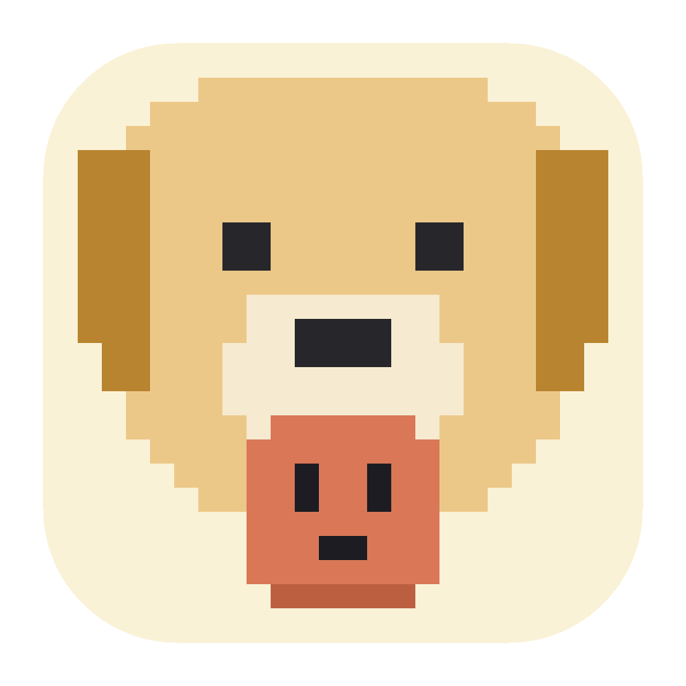

<p align="center">
  
</p>

<h1 align="center">GoFetch</h1>

<p align="center">
  An ambient desktop monitor for <strong>Claude Code</strong> sessions.<br/>
  A pixel-art retriever keeps watch on your terminal — so you don't have to.
</p>

---

## What is GoFetch?

GoFetch is a lightweight, read-only desktop widget that personifies your running
Claude Code (CLI) sessions as pixel characters and sends a native OS
notification the moment a session **needs you** — waiting for input, hitting an
error, or finishing its work.

The core question it answers: *"Did GoFetch save me time by telling me, while I
wasn't watching the terminal?"*

> GoFetch is an independent companion app **for** Claude Code. It is not
> affiliated with or endorsed by Anthropic.

## Features

- **Five-state session model** (in monitoring priority order):

  | Priority | State | Trigger | Notification |
  |---|---|---|---|
  | 1 | 🟡 Waiting | permission / idle prompt | ✅ |
  | 2 | 🔴 Error | failure (rate limit, overload, …) | ✅ |
  | 3 | 🔵 Done | task finished | ✅ |
  | 4 | 🟢 Working | tool activity | — |
  | 5 | ⚪ Idle | quiet after finishing | — |

- **Two views**
  - **Cards** — a compact list: one card per session with state, summary, and
    elapsed time, each with a live animated character.
  - **Animated** — a free-roaming pseudo-3D stage: every session is a pixel
    character strolling on a floor plane. Depth maps to scale and draw order,
    leashes connect parents to children (sessions and their sub-agents), and a
    separation pass keeps the crowd tidy. States that need your attention
    (waiting / error / done) stop wandering and act out their motion in place
    so they can't slip out of the corner of your eye.

- **Drag & click** — pick a character up and drop it anywhere on the stage;
  click it for a detail popover (state, project, path, elapsed, stop
  monitoring).

- **Seven characters**, selectable in Settings, each with custom motions per
  state (32×26 pixel-art frames):

  | Character | Working | Waiting | Error | Done |
  |---|---|---|---|---|
  | Dog (retriever) | digs the ground | spins in place | growls | fetches a small AI character |
  | Robot | transforms into a UFO and flies | radar sweep | smoke + sparks | thumbs-up |
  | Penguin | pecks ice, wings beating | spins | angry flapping | brings a fish |
  | Terminator | fires a shotgun from his bike | head scan | backfire | thumbs-up |
  | Cat | rolls a toy ball | chases its tail | arched-back hiss | brings a mouse |
  | Jensen Huang | tinkers on a GPU, green sparks | arms crossed | facepalm | raises the GPU |
  | Dust | green agitated swirl | pulsing | red spiky jitter | sparkle burst |

- **Quality-of-life** — tray icon, hide/restore, always-on-top, auto-hide when
  idle, autostart on login, per-type notification toggles, window size/position
  persistence, `prefers-reduced-motion` support, and animation pauses while the
  window is hidden so the widget never burns battery unwatched.

## How it works

```
Claude Code session
   │  lifecycle hooks (registered in ~/.claude/settings.json)
   ▼
localhost HTTP server (Rust)          ← never blocks your session
   │  session id → 5-state machine
   ▼
widget UI (WebView) + native notifications
```

1. GoFetch registers HTTP hooks into `~/.claude/settings.json` on launch —
   **merging** with any hooks you already have, and removing only its own
   entries on quit.
2. Each hook event is POSTed to a local server, mapped to a session, and run
   through the state machine.
3. The widget re-renders on every snapshot; waiting / error / done states fire
   a native notification.

### Privacy & safety, by design

- **Local-only.** All data is processed on your machine. Session summaries and
  logs are never sent to any external server.
- **Read-only.** GoFetch observes sessions; it never stops them or sends them
  commands.
- **Non-blocking.** Hooks treat connection failures and timeouts as
  fire-and-forget — if the widget isn't running, Claude Code is unaffected.

## Known limitations (Claude Code upstream)

GoFetch can only show what Claude Code's hooks report. Two gaps come from
**Claude Code itself, not GoFetch**, and affect every hook-based monitor equally.
Observed on Claude Code **2.1.172**; exact behavior is version-dependent, so
verify on your own version with the runbook below.

- **Interrupted turns emit no event — in every environment.** When you interrupt
  a running turn (Esc / Ctrl+C), Claude Code fires no hook: the official
  [hooks reference](https://code.claude.com/docs/en/hooks) states *"Stop hooks do
  not fire if stoppage occurred due to user interrupt,"* `StopFailure` only fires
  on API errors, and there is no dedicated interrupt hook. An interrupted session
  therefore stays in its **last** state (usually 🟢 Working) until a later event
  arrives or it is evicted after the stale timeout. This is not specific to IDEs —
  the terminal CLI behaves the same way.

- **IDE extensions don't fire the permission `Notification` hook (VS Code
  confirmed).** The VS Code extension renders permission prompts in its own native
  UI and does **not** fire the `Notification` (`permission_prompt`) hook, so a
  session waiting for your approval inside VS Code stays 🟢 Working instead of
  turning 🟡 Waiting. `Stop` and `PreToolUse` *do* fire in the extension, so
  Working/Done still work — only Waiting is missed. The settings file
  (`~/.claude/settings.json`) is shared between the CLI and the extension. This is
  tracked in upstream Claude Code issues. JetBrains hook behavior is undocumented
  and unverified.

### Verify on your version

GoFetch logs every event it receives to stderr, so you can confirm exactly what
your Claude Code version emits — no guessing:

1. Run `npm run dev` and watch the console for `[gofetch] event session_id=… hook_event_name=… -> …` lines.
2. In a **terminal** Claude Code session, trigger a permission prompt (e.g. a file
   write), then press Esc to interrupt — note which `hook_event_name`s arrive.
3. Repeat inside the **VS Code** extension and compare. Anything that doesn't show
   up in the log is a gap on the Claude Code side, not in GoFetch.

## Installation

### Download

Grab `GoFetch_<version>_aarch64.dmg` from releases (macOS, Apple Silicon),
open it, and drag **GoFetch** into Applications.

> The DMG is currently unsigned — on first launch, right-click the app and
> choose *Open* to pass Gatekeeper.

### Build from source

Requirements: [Rust](https://rustup.rs), [Node.js](https://nodejs.org), and the
[Tauri 2 prerequisites](https://v2.tauri.app/start/prerequisites/).

```bash
npm install
npm run dev      # run in development mode
npm run build    # produce GoFetch.app + .dmg under src-tauri/target/release/bundle/
```

## Development

| Path | What lives there |
|---|---|
| `src-tauri/src/` | Rust backend — localhost hook server, session state machine, notifications, hook (un)installer, settings, tray |
| `src/` | Widget frontend (vanilla JS, no bundler) |
| `src/sprite-engine.js` | Frame-based pixel-sprite engine — text grids → SVG, one shared rAF ticker |
| `src/sprites/` | Character sheets: the artwork is plain text, one character per pixel |
| `src/anim-mode.js` | Roaming stage — pseudo-3D projection, per-state stroll behavior, leashes, drag |
| `scripts/gen-icon.mjs` | App icon generator (`node scripts/gen-icon.mjs`, then `npm run tauri icon app-icon-1024.png`) |

```bash
cd src-tauri && cargo test       # backend test suite
node --check src/*.js            # frontend syntax pass
./scripts/mock-events.sh         # feed fake hook events to a running widget
```

Sprite frames are arrays of strings — the grid *is* the artwork, so character
changes are reviewable in any diff. Adding a character means dropping a sheet
into `src/sprites/` and registering it in `src/sprites/index.js`.

## Roadmap

- ✅ Sprint 1 — MVP: hook → state → widget/notification pipeline
- 🔜 Sprint 2 — hook mapping precision, multi-session accuracy, regression suite
- ✅ Sprint 3 (graphics) — sprite engine, roaming stage, character roster
- 🔜 Sprint 4 — mobile companion (opt-in, minimal state signals only)
- 🔜 Sprint 5 — signing/notarization, auto-update, distribution

## License

[MIT](LICENSE) © 2026 Sunwoo Jung.
